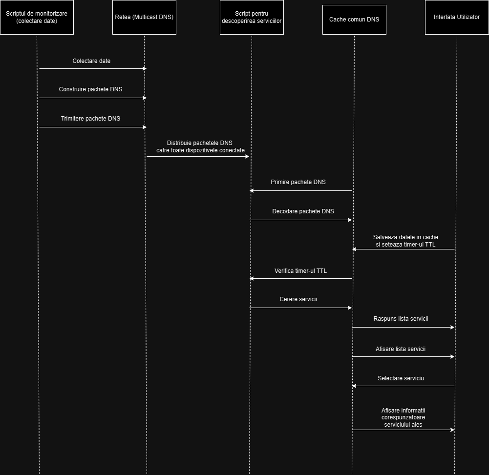

# mDNS și DNS-SD

## Ce este DNS?
DNS (Domain Name System) este principalul index al internetului, care direcționează traficul interogărilor de pe site-urile web. Cea mai simplă analogie este cu lista de contacte de pe telefon: contactele sunt afișate în funcție de nume, dar pot conține și numere de telefon sau adrese. Pe scurt, DNS reprezintă, de fapt, internetul. Toate serverele de internet lucrează cu adrese de Internet Protocol (IP), care arată în general ca niște grupuri de cifre separate prin punct (de exemplu, 123.456.789.100), dar pot avea și alte formate.

DNS este sistemul care asociază numele de domenii cu adresele IP corespunzătoare. Când un utilizator al internetului introduce un nume de domeniu în browser, furnizorul local de servicii de internet (ISP) utilizează DNS pentru a identifica adresa IP corespunzătoare, permițându-i astfel utilizatorului să descarce pagina sau resursa dorită. Următoarele etape specifice se desfășoară în culise, dar, pentru utilizatorul obișnuit, experiența se încheie aici.

### Cum funcționează DNS:
Un DNS utilizează pașii următori, deși o memorie cache locală dintr-un browser sau sistem de operare poate ocoli unii dintre acești pași.

- **Inițierea interogării de către utilizator**: utilizatorul browserului web inițiază interogarea introducând un nume de domeniu, făcând clic pe un hyperlink sau încărcând un marcaj. Interogarea este setată pe internet la un resolver DNS recursiv.

- **Rezolvare TLD**: resolverul interoghează un nameserver autoritativ, care generează răspunsul domeniului de nivelul zero (TLD), care identifică sufixul domeniului (.com, .org etc.) și redirecționează solicitarea.

- **Rezolvare nameserver**: serverul TLD răspunde cu adresa IP corespunzătoare nameserverului domeniului.

- **Rezolvare adresă IP**: după identificarea nameserverului, resolverul DNS recursiv interoghează nameserverul domeniului. Nameserverul răspunde cu adresa IP corespunzătoare.

- **Transfer de date**: după identificarea adresei IP, browserul poate solicita transferul datelor către pagina și/sau resursa vizată utilizând protocolul de transfer hipertext (HTTP).

## Ce este MDNS și cum funcționează?
Multicast DNS (mDNS) este un protocol care are ca scop să ajute la rezolvarea numelor în rețelele mai mici. În acest scop, adoptă o abordare diferită față de DNS-ul bine cunoscut. Toți participanții din rețea sunt abordați direct. Clientul corespunzător trimite un multicast în rețea, întrebând care participant din rețea corespunde cu numele gazdei. Un multicast este o formă unică de comunicare prin care un mesaj individual este direcționat către un grup de destinatari. Grupul poate fi format, de exemplu, din întreaga rețea sau o subrețea.

Astfel, cererea ajunge și la participantul din grup care deține numele gazdei căutat. Acesta răspunde întregii rețele (tot prin multicast). Toți participanții sunt informați despre legătura dintre nume și adresa IP și pot face o înregistrare în cache-ul lor mDNS. Atâta timp cât această înregistrare este validă, nimeni din rețea nu mai are nevoie să solicite numele gazdei.

Multicast DNS generează un volum relativ mare de trafic, dar încearcă să economisească resursele active ale rețelei. În acest scop, clientul care face cererea trimite (în funcție de înregistrarea curentă din cache) răspunsul pe care îl consideră corect. Numai atunci când acest răspuns nu mai este corect sau când înregistrarea este pe cale să expire, destinatarul trebuie să răspundă. Ceilalți participanți sunt deja informați înainte să primească un răspuns. Cu ajutorul acestui protocol, traficul din rețea poate fi redus.

În general, doar numele gazdelor care se termină cu `.local` sunt posibile cu multicast DNS. Aceasta limitează această formă de rezolvare a numelor la rețelele locale. Numele gazdelor cu alte domenii de nivel superior (TLD) – cum ar fi `.de` sau `.com` – nu sunt procesate de mDNS. Astfel, adresele web nu pot fi rezolvate în acest mod.

DNS și mDNS, deși funcționează la scări și domenii diferite, sunt ambele componente esențiale ale comunicării în rețea. DNS este esențial pentru a traduce numele de domenii ușor de înțeles de către oameni în adrese IP lizibile de către mașini, permițându-ne astfel să accesăm site-uri web și servicii pe internet. Pe de altă parte, mDNS este crucial pentru facilitarea descoperirii și comunicării dispozitivelor în rețelele locale fără a fi nevoie de un server DNS dedicat. Este important să înțelegem rolul și funcționalitatea ambelor sisteme pentru a gestiona și depana eficient problemele de rețea.

## Ce este DNS-SD

DNS-SD (DNS Service Discovery) este un protocol utilizat pentru descoperirea serviciilor disponibile într-o rețea locală (LAN) folosind DNS. Acesta face parte dintr-o familie de tehnologii care permit dispozitivelor să se găsească și să interacționeze într-o rețea fără a fi nevoie de configurări manuale. DNS-SD este adesea utilizat împreună cu Multicast DNS pentru descoperirea serviciilor în rețele locale care nu au un server DNS tradițional.

DNS-SD permite dispozitivelor să anunțe ce servicii sunt disponibile (cum ar fi imprimante, servere web, streaming media, etc.) și să descopere astfel de servicii oferite de alte dispozitive.

Fiecare serviciu este identificat printr-un tip de serviciu unic, de exemplu, _http._tcp. pentru servere web sau _ipp._tcp. pentru imprimante (Internet Printing Protocol). Aceasta specifică protocolul utilizat (de exemplu, TCP sau UDP) și natura serviciului.

În rețelele locale, DNS-SD utilizează adesea Multicast DNS pentru a face acest lucru fără un server DNS centralizat. mDNS permite dispozitivelor să trimită cereri și răspunsuri către toate dispozitivele dintr-o rețea locală, astfel încât să se poată descoperi reciproc fără o infrastructură specială.

DNS-SD permite dispozitivelor și serviciilor să se descopere automat fără intervenția manuală a utilizatorului. De exemplu, utilizatorii pot găsi imprimante, servere de fișiere sau alte dispozitive de rețea disponibile fără a fi nevoie să cunoască adresele IP sau alte detalii de configurare. Aceasta simplifică semnificativ utilizarea serviciilor în rețele locale, reducând efortul de configurare și intervenție tehnică.
 
# Implementare mDNS și DNS-SD - Aplicație demonstrativă

## Scopul proiectului
Proiectul presupune crearea unei aplicații demonstrative care folosește Multicast DNS (mDNS) și DNS Service Discovery (DNS-SD) pentru monitorizarea resurselor sistemului (precum CPU, memorie, temperaturi) și pentru a permite descoperirea acestor resurse în rețeaua locală. Vom implementa un modul de monitorizare care expune aceste date sub formă de servicii DNS-SD și un modul de descoperire a acestor servicii.

Scopul programului este să ofere o soluție practică pentru monitorizarea și descoperirea serviciilor și resurselor disponibile într-o rețea locală fără a depinde de un server DNS centralizat. Într-o rețea mică, cum ar fi cea de acasă sau de la birou, acest sistem poate ajuta la gestionarea dispozitivelor conectate într-un mod eficient și fără configurații complexe. Programul este util, de exemplu, pentru monitorizarea unui set de computere sau dispozitive IoT care partajează resurse și comunică automat între ele.

## Modulele aplicației
Programul este împărțit în două module principale:
1. **Modul de monitorizare a resurselor** – monitorizează în timp real anumite resurse ale sistemului (cum ar fi CPU, memorie, temperatură), expunând aceste date ca servicii DNS-SD.
2. **Modul de descoperire a serviciilor** – permite utilizatorilor din rețeaua locală să descopere și să acceseze aceste resurse.

## Pași de implementare

### Structurarea și implementarea pachetelor (mDNS) și (DNS-SD)
Pachetele mDNS și DNS-SD sunt mesaje transmise prin socket-uri, structurate conform standardului DNS. Vom crea structurile acestor pachete astfel încât să conțină:

- **Înregistrări SRV** pentru a defini numele și locația serviciilor:
  - Înregistrarea „serviciu” DNS (SRV) specifică o gazdă și un port pentru anumite servicii, cum ar fi vocea peste IP (VoIP) sau mesageria instantanee.
  - Majoritatea celorlaltor înregistrări DNS specifică doar un server sau o adresă IP, dar înregistrările SRV includ și un port la acea adresă IP. 
  - Exemple de format:
    - Structura generală: `_service._proto.name. TTL class type priority weight port target`
    - Exemplu: `_xmpp._tcp.example.com. 86400 IN SRV 10 5 5223 server.example.com`

  În acest exemplu:
  - „_xmpp” indică tipul de serviciu (protocolul XMPP),
  - „_tcp” indică protocolul de transport TCP,
  - „example.com” este gazda sau numele domeniului,
  - „server.example.com” este serverul țintă,
  - „5223” indică portul din acel server.

- **Înregistrări PTR** pentru a asocia numele serviciilor DNS-SD cu o instanță specifică:
  - Înregistrările PTR sunt utilizate pentru căutarea DNS inversă (reverse DNS lookup). Folosind adresa IP, puteți obține numele de domeniu sau de gazdă asociat. Pentru fiecare înregistrare PTR ar trebui să existe o înregistrare A.
  - O înregistrare pointer (PTR) este un tip de înregistrare DNS care rezolvă o adresă IP la un nume de domeniu sau gazdă, invers față de înregistrările A.

- **Înregistrări A** pentru a asocia fiecare nume de serviciu cu o adresă IP:
  - „A” înseamnă „adresă” și este tipul fundamental de înregistrare DNS: indică adresa IP a unui anumit domeniu.
  - Exemple de utilizare:
    - La accesarea unei adrese web, înregistrarea A va returna adresa IP corespunzătoare (de exemplu, `104.17.210.9` pentru `cloudflare.com`).
  - Aceasta permite dispozitivului unui utilizator să se conecteze și să încarce un site web, fără ca utilizatorul să memoreze și să tasteze adresa IP reală.

- **Înregistrarea „text” DNS (TXT)** permite unui administrator de domeniu să introducă text în DNS. Textul este stocat sub formă de unul sau mai multe șiruri între ghilimele.
  - DNS-SD folosește înregistrările DNS TXT pentru a stoca perechi arbitrare cheie/valoare care transmit informații suplimentare despre serviciul numit. Fiecare pereche cheie/valoare este codificată ca șir constitutiv propriu în înregistrarea DNS TXT, sub forma „cheie=valoare” (fără ghilimele). Totul până la primul caracter „=” este cheia. Totul după primul caracter „=” până la sfârșitul șirului (inclusiv caracterele „=” ulterioare, dacă există) este valoarea.

Utilizarea acestei sintaxe standardizate cheie/valoare în înregistrarea TXT facilitează extinderea acestor definiții de bază prin definirea unor atribute denumite suplimentare.

Se observă că fiecare înregistrare TXT are asociată o valoare **TTL** (Time To Live). Aceasta este o valoare care definește perioada de timp în care un pachet de date sau o înregistrare ar trebui să existe pe o rețea, un computer sau un server înainte de a fi eliminată sau revalidată. Valoarea TTL dintr-o înregistrare DNS îi spune unui resolver recursiv sau local cât timp să memoreze în cache o înregistrare DNS înainte de a contacta serverul autorizat pentru a obține o nouă copie. Este ca o dată de expirare a unei înregistrări DNS.

Toate aceste structuri trebuie construite manual în cadrul modulului socket, pentru a avea un control detaliat asupra mesajelor și al modului de comunicare.

### Pe scurt, înregistrările DNS sunt structurate astfel:
- **SRV**: specifică numele serviciului, protocolul de transport și numele de gazdă.
- **PTR**: asociază un serviciu DNS-SD cu o instanță specifică.
- **A**: înregistrare pentru asocierea IP-ului.
- **TXT**: pentru a expune datele colectate, sub forma cheie=valoare

# Scriptul de Monitorizare a Resurselor

Scriptul de Monitorizare a Resurselor este responsabil de colectarea datelor de performanță de la dispozitivul pe care rulează și de publicarea lor sub formă de înregistrări DNS, astfel încât alte dispozitive din rețea să le poată accesa prin DNS-SD.

## Implementare

La lansarea scriptului, se va inițializa mediul de comunicare în rețea prin configurarea unui socket UDP în mod multicast, care va permite trimiterea și primirea mesajelor către toate dispozitivele din rețeaua locală. De asemenea, se vor realiza configurațiile necesare pentru multicast.

Scriptul colectează periodic datele esențiale despre resursele de sistem, cum ar fi utilizarea procesorului, procentul de memorie utilizată și cantitatea efectivă folosită (în MB), temperatura medie a senzorilor hardware, utilizarea discului și spațiul utilizat, cantitatea de date trimise și primite. 

Scriptul folosește funcții specifice pentru a colecta date în timp real despre diverse resurse ale sistemului:

### Funcții de Monitorizare

- **CPU**: Funcția `monitorizare_cpu()` utilizează `psutil.cpu_percent()` pentru a obține procentul de utilizare al procesorului.
- **Memorie**: `monitorizare_memorie()` calculează procentul de memorie utilizată și cantitatea efectivă folosită în MB cu ajutorul funcției `psutil.virtual_memory()`.
- **Temperatură**: `monitorizare_temperatura()` folosește `wmi` pentru a accesa informații hardware despre temperatură, returnând o medie a valorilor senzorilor activi. Dacă senzorii nu sunt accesibili, se returnează "N/A".
- **Disc**: `monitorizare_disc()` furnizează utilizarea discului (procent și spațiul utilizat în GB).
- **Rețea**: `monitorizare_retea()` raportează cantitatea de date încărcate (upload) și descărcate (download) în MB.

### Monitorizarea Temperaturii

Pentru monitorizarea temperaturii am utilizat o altă librărie, `wmi`, ce permite accesarea informațiilor hardware, utilizând OpenHardwareMonitor (un instrument software open-source care permite accesarea și monitorizarea senzorilor hardware ai unui sistem, expunând datele despre hardware printr-un server integrat) pentru a citi datele senzorilor hardware direct dintr-o aplicație Python.

Funcțiile de monitorizare sunt incluse într-un dicționar `resurse_disponibile`, unde sunt stocate ca perechi cheie=valoare, pentru acces ușor și dinamic la fiecare monitorizare.

### Colectarea și Stocarea Datelor

Odată ce au fost colectate, datele sunt actualizate într-un dicționar local, unde sunt stocate ca perechi cheie=valoare, permițând accesul rapid la fiecare valoare monitorizată.

### Crearea Numele Gazdei și Serviciului

La fiecare ciclu de raportare, scriptul creează nume unice pentru gazdă și serviciu:

- **Gazda**: `obtine_nume_gazda()` generează un nume în formatul `Resurse-<ora_curentă>.local`.
- **Serviciul**: `obtine_nume_serviciu()` creează un nume de serviciu în formatul `_service._dns-sd-<ora_curentă>._tcp.local`.

Aceste nume sunt utilizate pentru identificarea serviciului în rețea.

## Construirea Pachetelor DNS

Funcția `construiește_pachet_dns` este responsabilă pentru crearea unui pachet DNS conform specificațiilor mDNS (Multicast DNS). Această funcție generează toate componentele unui pachet DNS necesar pentru publicarea unui serviciu, incluzând header-ul DNS și patru tipuri de înregistrări DNS: PTR, SRV, A și TXT.

### Componentele Pachetului DNS

- **Header-ul DNS**: Include metadate despre tipul pachetului (răspuns standard, 4 înregistrări).
- **Înregistrările DNS**:
  - **PTR**: Leagă numele serviciului de gazda care îl oferă.
  - **SRV**: Specifică locația serviciului (portul și numele gazdei).
  - **A**: Conține adresa IP a gazdei.
  - **TXT**: Încorporează informațiile despre resursele monitorizate sub formă de perechi cheie-valoare.

Funcția combină header-ul și cele patru înregistrări într-un singur pachet binar, gata pentru transmisie prin mDNS. Structura este compatibilă cu standardele DNS și poate fi utilizată de orice client care implementează mDNS.

### Publicarea Pachetelor DNS

Thread-ul principal rulează funcția `trimite_pachete_dns(...)`, care publică periodic resursele disponibile:

1. **Construirea pachetului**:
   - Se generează numele gazdei și serviciului.
   - Se colectează date despre resursele selectate utilizând funcțiile corespunzătoare.
   - Se creează pachetul DNS folosind `construiește_pachet_dns(...)`.
   
2. **Trimiterea pachetului**:
   După ce pachetul este construit, acesta este trimis către grupul multicast `224.0.0.251:5353` prin intermediul socket-ului UDP, asigurând că toate dispozitivele din rețea vor putea recepționa înregistrările. Se introduce o pauză de 5 secunde înainte de următoarea transmisie a unui nou pachet.

### TTL și Actualizarea Pachetelor DNS

Fiecare pachet trimis conține un parametru **TTL**. După expirarea acestui TTL, scriptul retrimite un nou pachet pentru a actualiza datele.

Un timer va controla frecvența transmiterii pachetelor, iar la fiecare ciclu, scriptul reîmprospătează datele și actualizează înregistrările, asigurând că informațiile sunt actuale.

### Actualizarea Resurselor Monitorizate

Dicționarul în care sunt stocate resursele monitorizate este actualizat la fiecare colectare de date pentru a reflecta în timp real modificările în utilizarea resurselor. Pe măsură ce valori noi sunt colectate, dicționarul este reconfigurat, iar datele vechi sunt suprascrise. Această actualizare constantă se reflectă în noile pachete DNS care sunt trimise, pentru a înlocui informațiile mai vechi din cache-ul dispozitivelor din rețea.

# Scriptul de Descoperire a Serviciilor

Scriptul de descoperire a serviciilor este responsabil pentru identificarea serviciilor disponibile în rețeaua locală și afișarea acestora utilizatorului. Acesta ascultă constant mesajele mDNS, decodează pachetele DNS și actualizează o structură internă care stochează serviciile detectate. Acest proces este gestionat prin două fire principale:

- **Firul pentru recepționarea serviciilor**: Ascultă mesajele mDNS, procesează pachetele și actualizează lista de servicii.
- **Firul pentru gestionarea duratei de viață (TTL)**: Verifică periodic serviciile stocate și elimină pe cele expirate.

## 1. Firul de recepție a datelor din rețea
Acest fir ascultă continuu mesajele mDNS din rețea pentru a identifica serviciile disponibile, primind și procesând pachetele mDNS și actualizează structura `servicii_detectate` cu serviciile noi sau actualizate.

- Se creează un socket UDP pentru recepția mesajelor.
- Se alătură grupului multicast mDNS (224.0.0.251) pentru a primi toate pachetele DNS din rețea pe portul 5353 și se permite mai multor aplicații să partajeze același port (`SO_REUSEADDR`).
- Firul primește și decodează Înregistrările PTR, SRV, A și TXT pentru a obține informații precum numele serviciului, locația acestuia (host, port), adresa IP și valorile resurselor.
- Funcția `decode_dns_packet` este responsabilă pentru interpretarea conținutului pachetelor DNS, extrăgând întrebările și înregistrările (PTR, SRV, A, TXT) și returnând o structură organizată cu acestea după ce au trecut prin procesul de decodare.

Informațiile decodificate sunt procesate pentru a actualiza lista `servicii_detectate`. Dacă există un serviciu nou, acesta este adăugat; dacă un serviciu deja existent are informații noi, acestea sunt actualizate. După fiecare actualizare, lista serviciilor detectate este afișată pentru a evidenția modificările.

## 2. Firul pentru gestionarea timpului de viață al serviciilor
Acest fir este responsabil pentru verificarea periodică a timpului de viață (TTL) al fiecărui serviciu din lista `servicii_detectate` și eliminarea serviciilor care au expirat.

- Firul rulează într-o buclă infinită și efectuează verificări periodice (o dată pe secundă).
- Compară timpul curent cu timpul de expirare al fiecărui serviciu. Dacă timpul de expirare a trecut, intrarea este ștearsă.
- Dacă toate intrările unui serviciu sunt șterse sau dacă serviciul nu mai are o înregistrare de tip PTR, serviciul este complet eliminat din lista `servicii_detectate` și informează utilizatorul printr-o notificare că serviciul respectiv a expirat.
- Cache-ul păstrează datele temporar, setând un timer TTL pentru fiecare intrare. Când acest timer expiră, datele respectivei intrări sunt eliminate automat, iar firul de execuție poate iniția interogări suplimentare pentru a verifica disponibilitatea serviciului.
- Firul de recepție scrie în cache-ul comun, astfel încât firul de interfață să poată citi datele și să afișeze lista de servicii actualizată.

# Descrierea Interfeței Grafice (GUI)

Interfața grafică creată în `gui.py` este o aplicație desktop dezvoltată folosind **PyQt5**, care permite utilizatorului să interacționeze vizual cu serviciile detectate în rețeaua locală. Aceasta oferă funcționalități de afișare, configurare și actualizare a informațiilor despre serviciile descoperite.

## Elementele Interfeței

### Checkbox-uri pentru resurse disponibile
- Prezintă o listă de resurse (CPU, Memorie, Temperatură, Disk, Rețea).
- Utilizatorul poate selecta sau deselecta resursele de interes.
- Se trimite un mesaj UDP către un `resources.py` pentru a notifica despre schimbările resurselor selectate.

### Control pentru TTL
- Un spinbox permite utilizatorului să configureze timpul de viață (**TTL**) al serviciilor.
- Valoarea TTL este transmisă, de asemenea, către server printr-un mesaj UDP.

### Lista serviciilor detectate
- Afișează serviciile detectate în rețeaua locală.
- Este actualizată automat la fiecare 2 secunde, sincronizându-se cu structura `servicii_detectate`.

### Detalii despre serviciu
- Afișează informații detaliate despre serviciul selectat din listă.
- Conținutul este preluat din structura `servicii_detectate`, sincronizată cu firele din `discover.py`.

## Funcționalitățile principale

### Actualizarea listei de servicii (`refresh_service_list`)
- Actualizează lista serviciilor din interfață folosind datele din structura partajată `servicii_detectate`.
- Utilizează un mutex (lock) pentru a preveni accesul simultan la resursele partajate.

### Afișarea detaliilor serviciului (`display_service_details`)
- Când utilizatorul selectează un serviciu din listă, sunt afișate detalii despre serviciu, adică înregistrările acestuia (**PTR**, **SRV**, **A**, **TXT**).

### Actualizarea resurselor selectate (`update_resurse_selectate`)
- Trimite selecția resurselor disponibile către un script-ul de monitorizare printr-un mesaj UDP.

### Actualizarea TTL (`update_ttl`)
- Trimite valoarea curentă a TTL către server.

## Interacțiunea între `gui.py` și `discover.py`

Cea mai importantă structură partajată între cele două scripturi este `servicii_detectate`, un dicționar care stochează toate informațiile despre serviciile descoperite. 

### Accesarea structurii partajate:
- **`discover.py`**: Actualizează structura atunci când primește noi pachete mDNS sau verifică expirarea TTL-urilor.
- **`gui.py`**: O folosește pentru a afișa serviciile în lista grafică și pentru a oferi detalii utilizatorului.

### Sincronizarea accesului la `servicii_detectate`
- Cele două scripturi rulează mai multe fire de execuție pentru a realiza sarcini simultane.
- Pentru a evita conflictele sau coruperea datelor, se folosește un mecanism de sincronizare (**mutex-ul**):
  - În **`discover.py`**: Actualizarea listei de servicii detectate (adăugare, modificare sau ștergere) se realizează sub protecția unui mutex.
  - În **`gui.py`**: Citirea listei de servicii pentru afișare se face tot sub protecția mutex-ului.

### Comunicare între scripturi
Când utilizatorul interacționează cu interfața (de exemplu, selectează resursele de monitorizat sau modifică TTL-ul), `gui.py` trimite aceste modificări direct către scriptul de monitorizare (cum ar fi `resources.py`) printr-un mesaj UDP.

## Firele de execuție din `gui.py`

### Fir pentru recepționarea serviciilor (`receptioneaza_servicii`)
- Acest fir ascultă pachetele mDNS din rețea și actualizează structura `servicii_detectate` cu serviciile detectate.
- Firul este demarat în `gui.py` pentru a se asigura că interfața poate afișa informațiile în timp real.

### Fir pentru gestionarea TTL (`gestioneaza_ttl`)
- Rulează în paralel și verifică periodic dacă timpul de viață al unui serviciu a expirat.
- Actualizează structura `servicii_detectate`, ștergând intrările expirate.

### Firele PyQt (evenimentele GUI)
- Timer-ul (`QTimer`) declanșează periodic (la 2 secunde) funcția `refresh_service_list()`, care sincronizează interfața grafică cu starea actuală a structurii `servicii_detectate`.

### Diagrama de secvență

## Bibliografie

- [Oracle: What is DNS?](https://www.oracle.com/ro/cloud/networking/dns/what-is-dns/)
- [IONOS: Multicast DNS (mDNS)](https://www.ionos.com/digitalguide/server/know-how/multicast-dns/)
- [Cloudflare: DNS SRV Record](https://www.cloudflare.com/learning/dns/dns-records/dns-srv-record/)
- [HostX: Ce este o înregistrare PTR?](https://www.hostx.ro/clienti/index.php?rp=/knowledgebase/1571/Ce-este-o-inregistrare-PTR.html)
- [IETF: RFC 6763 - DNS-Based Service Discovery (DNS-SD)](https://datatracker.ietf.org/doc/html/rfc6763)
- [Cloudflare: DNS PTR Record](https://www.cloudflare.com/learning/dns/dns-records/dns-ptr-record/)
- [Cloudflare: DNS TXT Record](https://www.cloudflare.com/learning/dns/dns-records/dns-txt-record/)
- [IBM: What is time to live (TTL)](https://www.ibm.com/topics/time-to-live)
